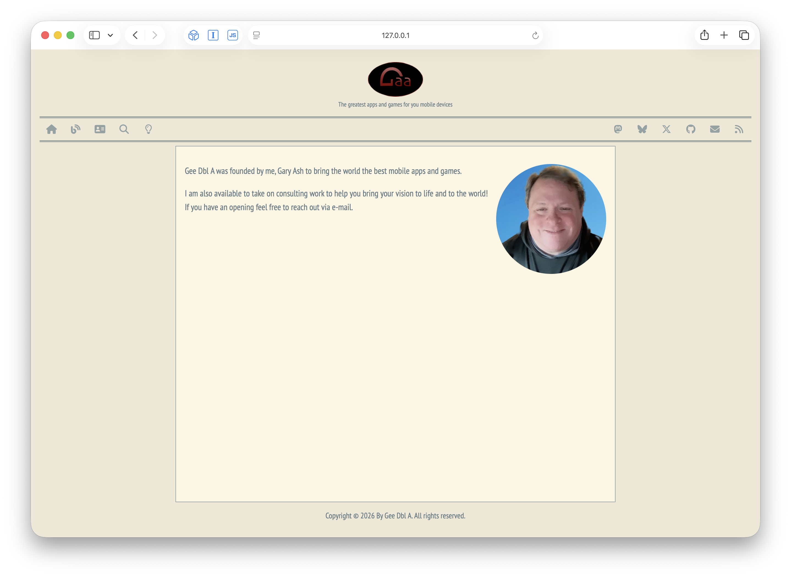

### Jekyll Website Template

A Jekyll site template using the Solarized color theme with light and dark mode support.

## Features

- **Solarized theme** — Light and dark modes with toggle button
- **Blog and product collections** — Separate content sections for blog posts and product pages
- **Pagination** — Paginated blog/product index via `jekyll-paginate-v2`
- **Search** — Client-side search page
- **Navigation bar** — Icon-based nav with tooltips (Home, Blog, About, Search, Theme Toggle)
- **Social links** — Mastodon, Bluesky, X/Twitter, GitHub, email, RSS
- **Favicons** — Full set of favicons for all platforms
- **Responsive** — Viewport-aware layout
- **Auto-redirect** — Redirects to About page when no posts exist

## Screenshots

| Light | Dark |
|-------|------|
|  |  |

## Structure

| Path | Description |
|------|-------------|
| `_blog/` | Blog post collection |
| `_products/` | Product page collection |
| `_drafts/` | Draft posts |
| `_includes/` | Partials: `common.html`, `header.html`, `footer.html`, `navigationbar.html` |
| `_layouts/` | Layouts: `default.html`, `blog-post.html` |
| `assets/css/` | SCSS styles (`main.scss`) and syntax highlighting (`syntax.css`) |
| `assets/favicons/` | Favicon set for all platforms |
| `assets/images/` | Site images (logo, author photo) |
| `categories/` | Category index pages (blog, product) |
| `scripts/` | Client-side JavaScript (`mode-switcher.js`) |

## Requirements

- Ruby with Bundler
- Jekyll and plugins (`jekyll-feed`, `jekyll-paginate-v2`)

## Usage

```bash
bundle install
bundle exec jekyll serve
```

## License

Copyright © 2026 Gary Ash. All rights reserved.
