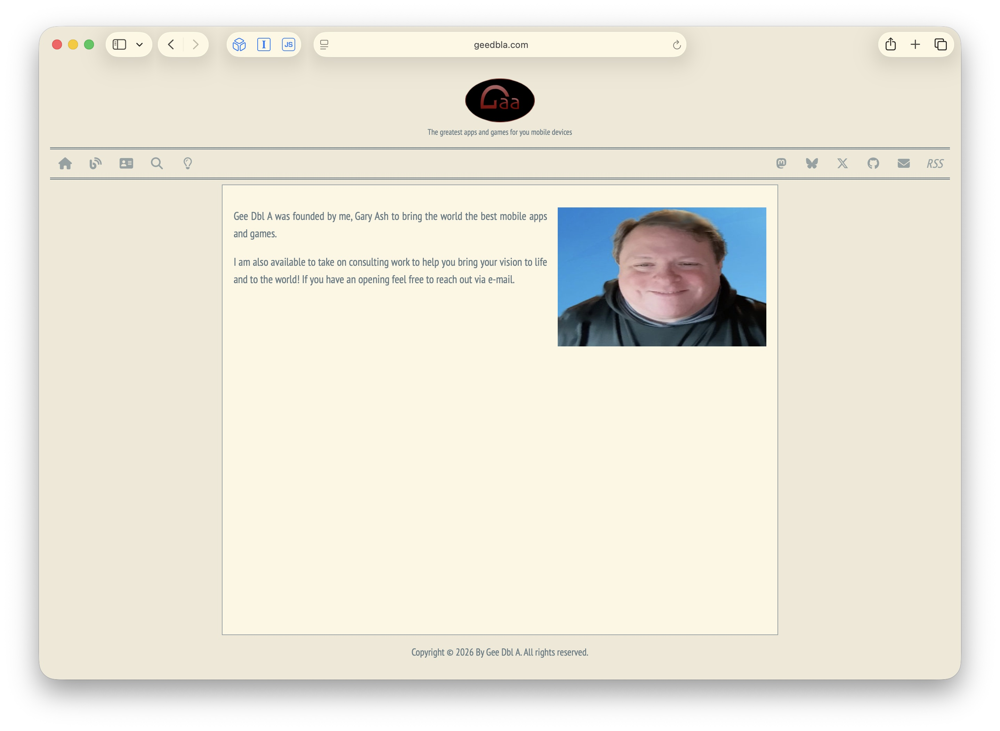
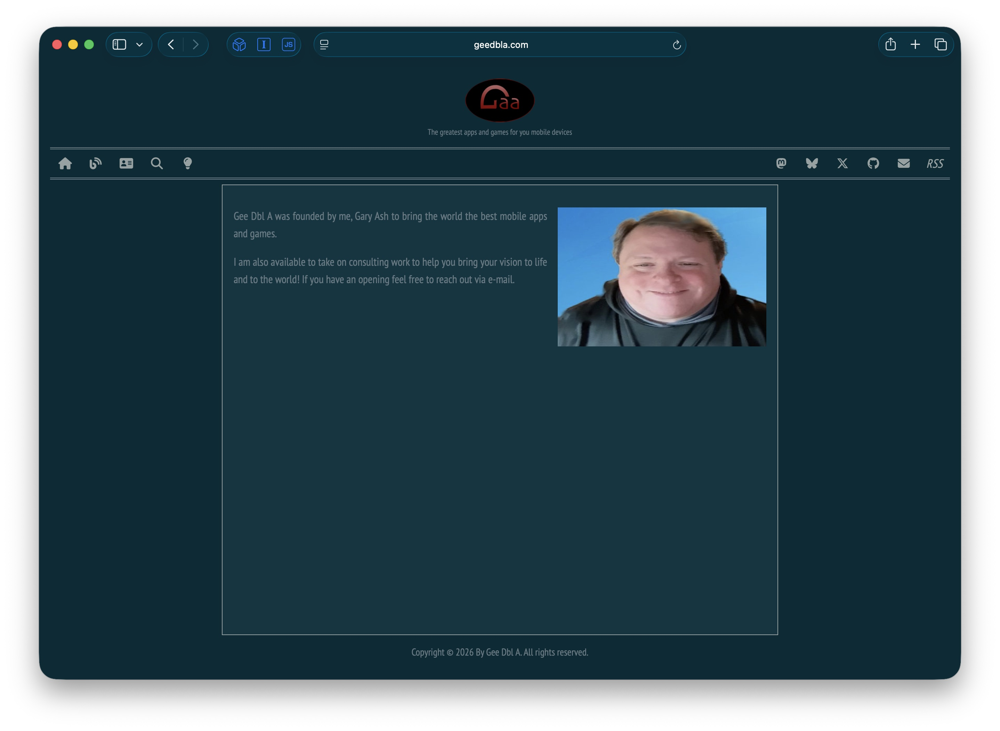

# Gee Dbl A Jekyll Template

A modern, responsive Jekyll template for personal portfolios and content platforms. Features a clean design with light/dark theme support, mobile-first layout, and built-in blog and product showcase capabilities.

## Screenshots

| Light Theme | Dark Theme |
|:-----------:|:----------:|
|  |  |

## Features

- **Dual Theme System** - Light and dark modes with system preference detection and manual toggle
- **Mobile Responsive** - Flexible layout that adapts to any screen size
- **Icon-Based Navigation** - Clean navbar with Font Awesome icons and tooltips
- **Blog & Product Collections** - Separate content collections with automatic pagination
- **Social Media Integration** - Built-in links for Mastodon, Bluesky, X/Twitter, GitHub, and email
- **RSS Feed** - Automatic feed generation via jekyll-feed plugin
- **Search** - DuckDuckGo-powered site search
- **Solarized Color Scheme** - Professional, eye-friendly color palette
- **No JavaScript Frameworks** - Lightweight vanilla JS implementation
- **Syntax Highlighting** - Code block highlighting via Rouge

## Getting Started

### Prerequisites

- Ruby 2.7 or higher
- Bundler gem (`gem install bundler`)

### Installation

1. Clone the repository:
   ```bash
   git clone https://github.com/Gary-Ash/JekyllTemplate.git
   cd JekyllTemplate
   ```

2. Install dependencies:
   ```bash
   bundle install
   ```

3. Start the development server:
   ```bash
   bundle exec jekyll serve
   ```

4. Open your browser to `http://localhost:4000`

### Building for Production

```bash
bundle exec jekyll build
```

The generated site will be in the `_site` directory.

## Project Structure

```
JekyllTemplate/
├── _config.yml              # Site configuration
├── _layouts/
│   ├── default.html         # Standard page layout
│   └── blog-post.html       # Paginated content layout
├── _includes/
│   ├── header.html          # Logo and site title
│   ├── footer.html          # Copyright footer
│   ├── navigationbar.html   # Icon navigation bar
│   └── common.html          # Head metadata and assets
├── _blog/                   # Blog post collection
├── _products/               # Product showcase collection
├── assets/
│   ├── css/                 # Stylesheets (SCSS)
│   ├── images/              # Site images
│   └── favicons/            # Multi-format favicons
├── scripts/                 # JavaScript files
├── categories/              # Category index pages
├── index.markdown           # Home page
├── about.markdown           # About page
└── search.html              # Search page
```

## Configuration

Edit `_config.yml` to customize:

```yaml
title: Your Site Title
description: "Your site description"
email: your@email.com
url: "https://yoursite.com"

# Social accounts
twitter_username: your_twitter
github_username: your_github
mastodon_account: https://instance/@you
bluesky_account: you.bsky.social
```

## Adding Content

### Blog Posts

Create files in `_blog/` with the naming convention `YYYY-MM-DD-title.markdown`:

```markdown
---
title: "My Post Title"
date: 2026-01-31
---

Your content here...
```

### Products

Create files in `_products/` with the same naming convention:

```markdown
---
title: "Product Name"
date: 2026-01-31
---

Product description...
```

## Technologies

- [Jekyll](https://jekyllrb.com/) - Static site generator
- [Font Awesome](https://fontawesome.com/) - Icon library
- [Google Fonts](https://fonts.google.com/) - Typography (Inconsolata, PT Sans Narrow)
- [Solarized](https://ethanschoonover.com/solarized/) - Color scheme

## Contributing

Contributions are welcome. Please read [CONTRIBUTING.markdown](.github/CONTRIBUTING.markdown) for guidelines.

## License

This project is licensed under the MIT License - see [LICENSE.markdown](LICENSE.markdown) for details.

---

Created by [Gary Ash](https://www.geedbla.com)
